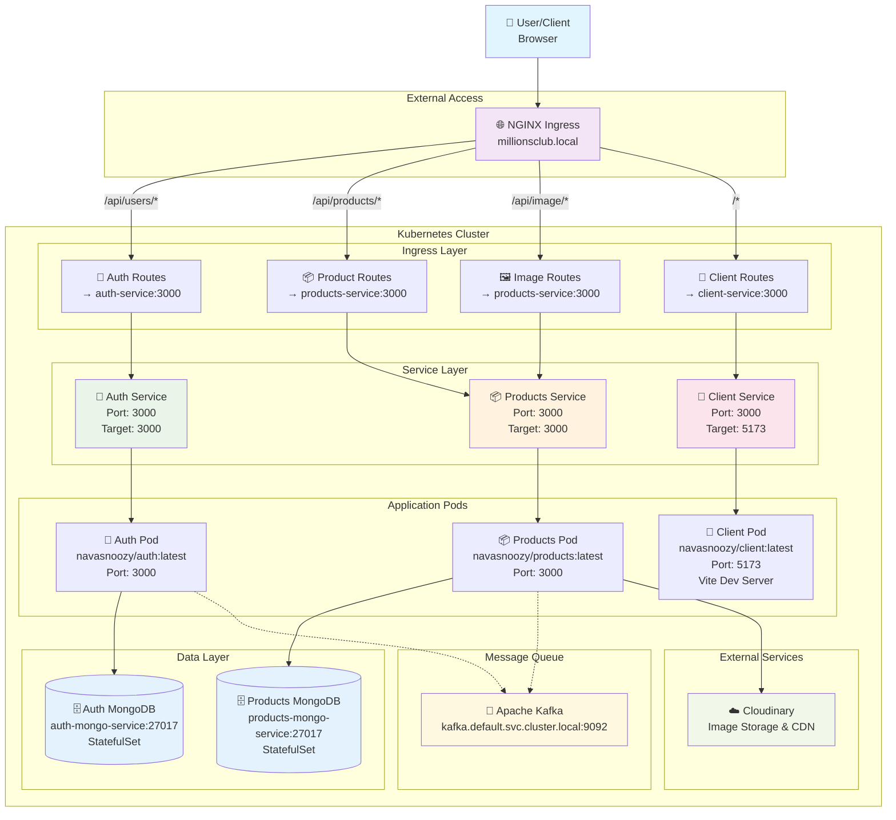

# MillionsClub Microservice Project

MillionsClub is a **production-ready, microservice-based e-commerce platform** designed with scalability, reliability, and maintainability in mind.

This project follows **industry best practices** and modern architectural patterns, bringing together **Node.js, TypeScript, React, Kafka, Kubernetes, Ingress NGINX, and Docker**.

Key highlights include:

* **Event-Driven Architecture (EDA)** – Microservices communicate asynchronously using **Kafka**, ensuring loose coupling and resilience.
* **Separation of Concerns** – Each service is fully isolated with its own database, deployment, and domain logic.
* **Shared Libraries** – Common schemas, error handling, and middlewares are extracted into **shared-libs** for consistency across services.
* **CI/CD Ready** – Clean codebase, modular structure, and K8s manifests enable seamless automation in modern DevOps pipelines.

***

## 📂 Project Structure

```
MillionsClub/
├─ auth/                # Authentication service
├─ client/              # React frontend application
├─ infra/               # Kubernetes manifests & infra setup
├─ products/            # Products service
├─ shared-libs/         # Shared TypeScript libraries (errors, middlewares, schemas, etc.)
├─ README.md            # Documentation
└─ skaffold.yaml        # Skaffold config for local K8s development
```

## 🛠 Tech Stack

### Backend
- **Node.js** + **Express**
- **TypeScript**
- **Kafka** (event-driven communication)
- **MongoDB** (database for auth & products)
- **Docker** (containerization)
- **Kubernetes (K8s)** (deployment & orchestration)
- **Ingress NGINX** (routing & load balancing for K8s services)
- **Skaffold** (K8s dev workflow)

### Frontend
- **React (Vite + TypeScript)**
- **React Query** for server state management
- **Material UI (MUI)** for styling
- **Cloudinary** for image storage

### Shared
- **Custom Shared Libraries**  
  - Published as a public npm package: [`@millionsclub/shared-libs`](https://www.npmjs.com/package/@millionsclub/shared-libs)  
    → Install with: `npm i @millionsclub/shared-libs`  
  - Provides reusable modules for **errors, schemas, middlewares, and Kafka clients**  
> **Note:** also includes utilities related to **credentials and security information**, used internally across services

***

## 🧩 Microservices

- **Auth Service (`auth/`)**
  - Handles user signup, signin, signout, JWT authentication
  - Publishes `UserCreated` events
  - Stores users & email verification data

- **Products Service (`products/`)**
  - Handles categories, products, variants, subcategories
  - Publishes `ProductCreated` events
  - Integrates with **Cloudinary** for image uploads

- **Client (`client/`)**
  - React frontend with admin & user dashboards
  - Authentication, product management, cart, and order flows

- **Shared Libraries (`shared-libs/`)**
  - Common schemas (Zod), middlewares, Kafka utilities, error handling

- **Orders, Payments, Notification Service (`orders/`, `payments/`)** 🚧 *Future Work*

***

## 🔗 Service Communication

Services communicate via **Kafka** with event-driven design.  
Each service has:
- **Publishers** – emit events when an action happens (e.g., user signup, product creation).
- **Consumers** – listen to events and update their local state accordingly.

***

## 🖼️ Architecture Diagram



## 🌍 Local Domain Setup

To access the app locally (via Ingress NGINX), you need to map the custom domain  
`millionsclub.local` to your local Kubernetes cluster (usually `127.0.0.1` or `minikube ip`).

### 🔧 Steps

1. Find your cluster IP:
   ```bash
   minikube ip
   ```

   Example output: `192.168.49.2`

2. Add an entry to your **hosts file**:

   * **macOS / Linux**
     Edit `/etc/hosts` (requires `sudo`):

     ```bash
     sudo nano /etc/hosts
     ```

     Add this line at the bottom (replace `<YOUR_CLUSTER_IP>`):

     ```
     <YOUR_CLUSTER_IP>  millionsclub.local
     ```

   * **Windows**

     1. Open Notepad as Administrator
     2. Open file:

        ```
        C:\Windows\System32\drivers\etc\hosts
        ```
     3. Add the line (replace `<YOUR_CLUSTER_IP>`):

        ```
        <YOUR_CLUSTER_IP>  millionsclub.local
        ```

3. Save the file, then test in your browser:

   http://millionsclub.local

✅ Now your local domain will point to the Kubernetes Ingress for MillionsClub.

***

## 🚀 Getting Started

### Prerequisites

* [Docker](https://www.docker.com/) 
* [Kubernetes](https://kubernetes.io/)
* [Skaffold](https://skaffold.dev/) for local dev
* [Node.js] (v18+)

### Local Development (K8s + Skaffold)

```sh
# Start skaffold with dev mode
skaffold dev
```

This will:

* Build Docker images for each service
* Deploy services into Kubernetes
* Watch for file changes and auto-redeploy

***

## 🐳 Dockerfiles

For consistency, each service has its own `Dockerfile`.  
Below are examples for **development** and **production** setups.

### Development Dockerfile
```dockerfile
FROM node:alpine

WORKDIR /app
COPY package*.json ./
RUN npm ci

COPY . .

CMD ["npm", "run", "dev"]
```

### Production Dockerfile
```dockerfile
# Stage 1: Builder
FROM node:20-alpine AS builder
WORKDIR /app

COPY package*.json ./
RUN npm ci

COPY . .
RUN npm run build    # compiles TS -> JS into /app/dist

# Stage 2: Runtime
FROM node:20-alpine
WORKDIR /app

COPY package*.json ./
RUN npm ci --omit=dev

COPY --from=builder /app/dist ./dist

CMD ["node", "dist/index.js"]
```

## 📜 Directory Tree

Here's the **full project structure**:
> **Note:** The structure shown below may change in the future as the project evolves with new features and improvements.

```
MillionsClub/
├─ auth/
│  ├─ src/
│  │  ├─ config/
│  │  ├─ events/
│  │  ├─ models/
│  │  ├─ routes/
│  │  ├─ test/
│  │  ├─ types/
│  │  ├─ utils/
│  │  ├─ app.ts
│  │  └─ index.ts
│  ├─ Dockerfile
│  ├─ package.json
│  └─ ...
├─ client/
│  ├─ public/
│  ├─ src/
│  │  ├─ components/
│  │  ├─ features/
│  │  ├─ hooks/
│  │  ├─ layouts/
│  │  ├─ lib/
│  │  ├─ pages/
│  │  └─ store/
│  ├─ Dockerfile
│  ├─ package.json
│  └─ ...
├─ infra/
│  └─ k8s/
│     ├─ kafka/
│     ├─ auth-depl.yaml
│     ├─ client-depl.yaml
│     ├─ ingress-srv.yaml
│     ├─ products-depl.yaml
│     └─ ...
├─ products/
│  ├─ src/
│  │  ├─ config/
│  │  ├─ controllers/
│  │  ├─ events/
│  │  ├─ middlewares/
│  │  ├─ models/
│  │  ├─ routes/
│  │  ├─ services/
│  │  ├─ types/
│  │  ├─ utils/
│  │  ├─ app.ts
│  │  └─ index.ts
│  ├─ Dockerfile
│  ├─ package.json
│  └─ ...
├─ shared-libs/
│  ├─ build/
│  ├─ src/
│  │  ├─ errors/
│  │  ├─ kafka/
│  │  ├─ middlewares/
│  │  ├─ schemas/
│  │  ├─ types/
│  │  ├─ client.ts
│  │  └─ server.ts
│  ├─ package.json
│  └─ tsconfig.json
├─ README.md
└─ skaffold.yaml
```

***

## ✅ Features

* [x] Authentication (JWT-based)
* [x] Event-driven architecture with Kafka
* [x] Product, Product variant & Category management
* [x] Image handling with Cloudinary
* [x] Shared libraries for consistency
* [x] Kubernetes deployment (with Skaffold dev workflow)

***

## 📌 Next Steps / Roadmap

* [ ] Implement Order & Checkout microservice
* [ ] Add Payment gateway integration

***

## 👨‍💻 Author

**MillionsClub Project**
Built with ❤️ by [Navas CK](https://github.com/navasnoozy)